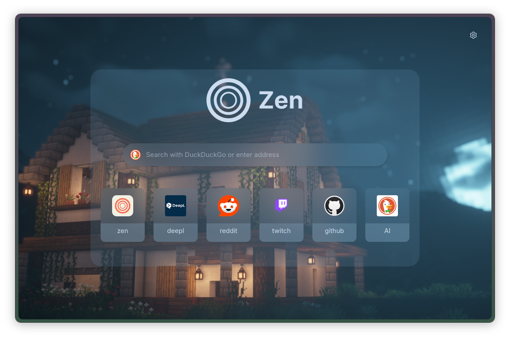
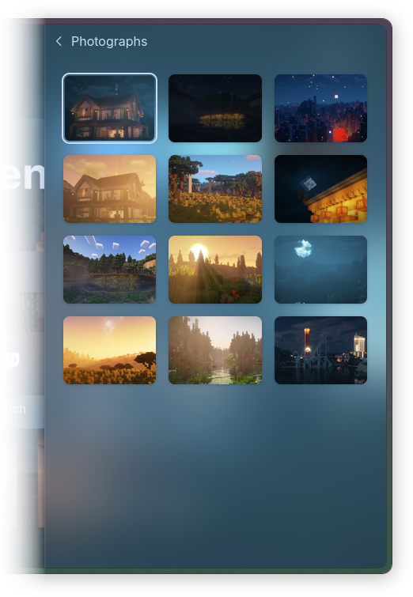

<h1 align=center>Better New Tab</h1>

<h3 align=center>This mod adds some blur, roundings and wallpapers to new tab</h3>

# Install

- [Import](https://developer.mozilla.org/en-US/docs/Web/CSS/@import) `shy-new-tab.css` to your `userContent.css`