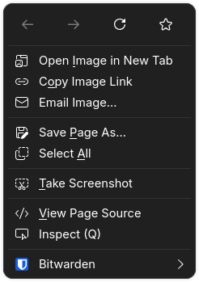
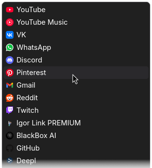

<h1 align=center>Compact Context Menu</h1>

<h3 align=center>This mod makes context menu and bookmarks popups compact</h3>

# Install

- [Import](https://developer.mozilla.org/en-US/docs/Web/CSS/@import) `shy-context-menu.css` to your `userChrome.css`
