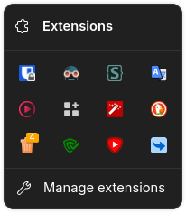

<h1 align=center>Compact extensions menu</h1>

<h3 align=center>This mod makes Extensions Menu compact</h3>

-----

# Install

- [Import](https://developer.mozilla.org/en-US/docs/Web/CSS/@import) `shy-unified-extensions.css` to your `userChrome.css`
