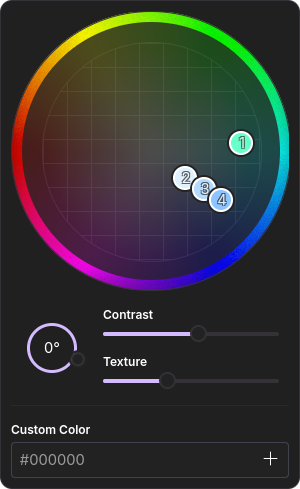

<h1 align=center>Better gradient editor</h1>

<h3 align=center>This mod restyles color palette and adds numbers to dots</h3>

# Install

- [Import](https://developer.mozilla.org/en-US/docs/Web/CSS/@import) `shy-gradient-editor.css` to your `userChrome.css`
