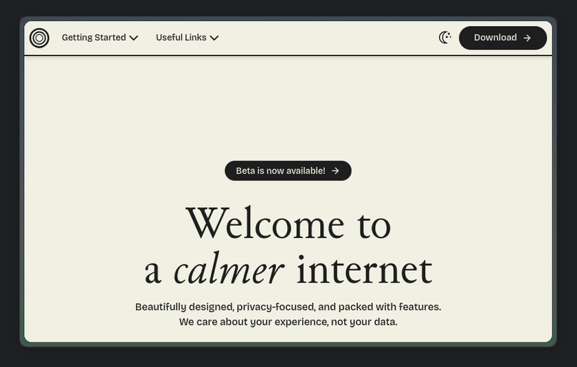

<h1 align=center>Hidden Toolbar</h1>

<h3 align=center>This mod turns the Bookmarks Toolbar into a hidden panel on the side.</h3>

-----

# Install

- [Import](https://developer.mozilla.org/en-US/docs/Web/CSS/@import) `shy-toolbar.css` to your `userChrome.css`
- Go to the Customize Toolbar... and move some buttons into toolbar

# Known Bugs

If you have added extension icons to the toolbar, when you revisit Customize Toolbar... Customize Toolbar again, the extension icons will be broken. To fix them, restart Zen. 

The toolbar is incompatible with all sorts of non-standard elements like a search box or a zoom control. Just regular buttons.
