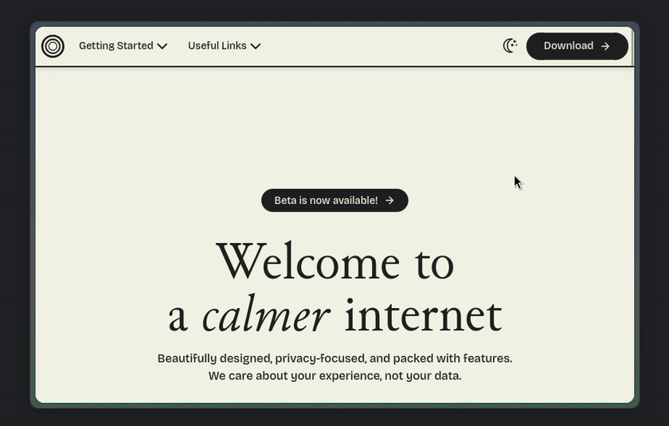

<h1 align=center>Modern Findbar</h1>

<h3 align=center>This mod makes findbar (ctrl + f) cooler</h3>

# Install

- [Import](https://developer.mozilla.org/en-US/docs/Web/CSS/@import) `shy-findbar.css` to your `userChrome.css`
