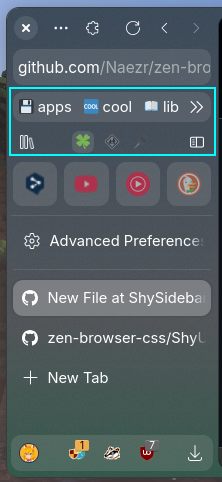
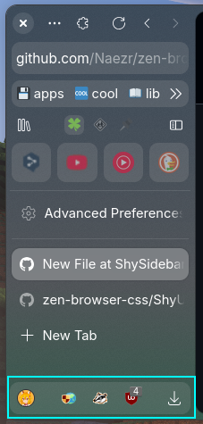
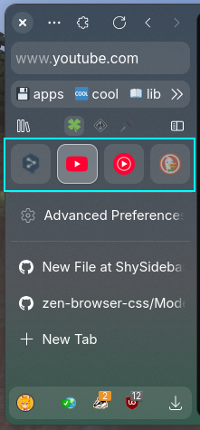

<h1 align=center> 1/3 Sidebar top actions</h1>

<h3 align=center>This mod adds bookmarks and workspaces strip at sidebar top</h3>

# Install

### Step 1
- [Import](https://developer.mozilla.org/en-US/docs/Web/CSS/@import) `shy-sidebar-top-actions.css` to your `userChrome.css`

### Step 2

- Open Menu Button (3 dots) > Bookmarks > Show Bookmarks Toolbar
- Right click on sidebar > Customize Toolbar...
- Restart Zen Browser right in customizing mode.
- Put items inside sidebar in this order:
   + `bookmarks`
   + `some button` (optional)
   + `some button` (optional)

[Video guide (outdated)](https://imgur.com/a/sidebar-video-guide-PynnoXv)

### Options for `about:config`
- `shy-zen.workspaces-on-top` - Enables workspaces switcher on top
- `shy-zen.bookmarks.scrollable-horizontal` - Makes bookmarks scrollable in horizontal direction. Can be scrolled only by touchpad, shift+scroll or by horizontal mouse wheel
- `shy-zen.bookmarks.scrollable-vertical` - Makes bookmarks scrollable in vertical direction. Can be scrolled just by mouse

> [!NOTE]
> Do not set both scrolling parameters to `true` at the same time

-----

<h1 align=center> 2/3 Sidebar bottom actions</h1>

<h3 align=center>This mod makes sidebar bottom actions look cooler</h3>

# Install

- [Import](https://developer.mozilla.org/en-US/docs/Web/CSS/@import) `shy-sidebar-bottom-actions.css` to your `userChrome.css`

> [!NOTE]
> If you want to move workspaces switcher away from here, use `shy-sidebar-top-actions.css` and set `shy-zen.workspaces-on-top` to `true`

-----

<h1 align=center> 3/3 Shy tabs</h1>

<h3 align=center>This mod adds few tweaks to essentials and normal tabs too</h3>

# Install

- [Import](https://developer.mozilla.org/en-US/docs/Web/CSS/@import) `shy-sidebar-tabs.css` to your `userChrome.css`
