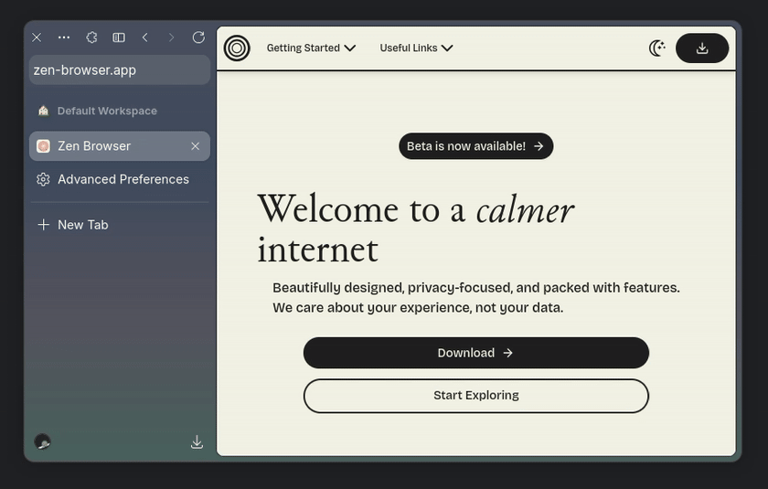

<h1 align=center> 1/2 Scrollable URLBar</h1>

<h3 align=center>This mod makes buttons in URLBar scrollable in Single Toolbar mode</h3>

# Install

- [Import](https://developer.mozilla.org/en-US/docs/Web/CSS/@import) `shy-urlbar-scrollable.css` to your `userChrome.css`

-----

<h1 align=center> 2/2 Better floating URLBar</h1>

<h3 align=center>This mod makes floating urlbar look cooler</h3>

# Install

- [Import](https://developer.mozilla.org/en-US/docs/Web/CSS/@import) `shy-urlbar-floating.css` to your `userChrome.css`
